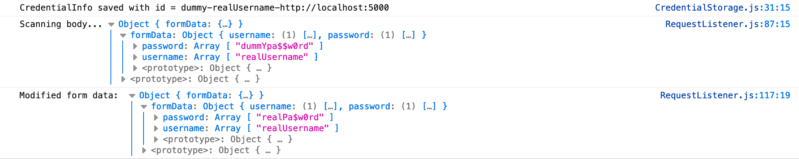

## Test results

The Secure Credential Provison prototype has been tested on the login web pages of 100 web applications.\
If the approach was successful, the log messages in the Console tab should look similiar to this:

The results for the 100 web applications: [Secure Credential Provision - Test results](./Secure_Credential_Provision_Test_Results.pdf)
